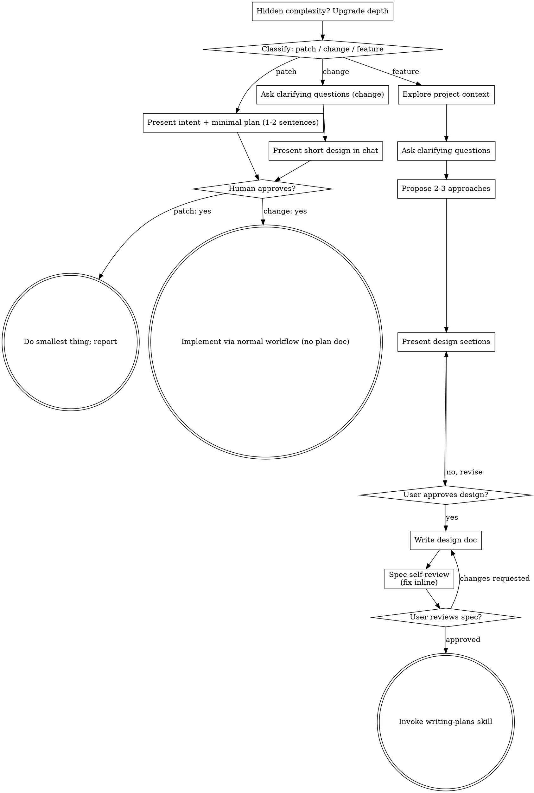

# Brainstorming Ideas Into Designs

Help turn ideas into fully formed designs and specs through natural collaborative dialogue.

Start by classifying the request by DEPTH, then work through the depth's
process: understand the context, refine the idea, present a design, and
get your human partner's approval.

<HARD-GATE>
Do NOT invoke any implementation skill, write any code, scaffold any
project, or take any implementation action until you have told your
human partner what you intend and they have approved it. This applies
to EVERY task at EVERY depth below — the ceremony scales with the task;
the approval gate never does.
</HARD-GATE>

## Three Depths

Before your first question, classify the request by DEPTH and say the
classification out loud — "this looks like a `change`, so I'll present
a short design here rather than write a spec" — so your human partner
can override it. The three depths, in increasing size, are **patch**,
**change**, and **feature**.

- **Patch** — the smallest depth: a one-line fix, a config tweak, a
  targeted spot-tightening, or a quick feasibility probe whose output
  is an answer, not code you keep. Present the intent in 1-2
  sentences, get a nod, then keep it minimal. No design doc, no spec
  file. If a probe yields code you now want to keep, that is a NEW
  request — reclassify it and get its own approval.
- **Change** — a well-scoped modification to code that already exists
  in this repo: a new flag, a small endpoint, a small feature spanning
  a few files. Familiarity with the KIND of app is not enough — the
  flow you are changing must already be here to read. If there is no
  existing flow to change, the depth is not `change`. Ask the
  clarifying questions that matter, present a short design IN CHAT (a
  few sentences to a few short paragraphs), and STOP. Implementation
  starts only after your human partner says yes to that design — a
  `change`-depth approval is as hard a gate as a `feature`-depth one.
  No spec file, no implementation plan document.
- **Feature** — new projects, new subsystems, changes that restructure
  how components fit together or alter interfaces others depend on.
  Follow the full process: questions, approaches, sectioned design,
  written spec, then the writing-plans skill.

When in doubt between two depths, take the heavier one. The ratchet is
one-way: hidden complexity discovered mid-task upgrades the depth —
stop, say so, and step up. Nothing downgrades mid-task.

## Anti-Pattern: "Too Simple To Need Approval"

Every depth ends with your human partner approving your intent before
implementation. A todo list, a single-function utility, a config
change — the design may be two sentences in chat, but you MUST present
it and get approval. "Simple" tasks are where unexamined assumptions
cause the most wasted work. What scales with simplicity is the
artifact, never the approval.

## Red Flags

| Thought | Reality |
|---------|---------|
| "This is too simple to need a design" | Simple means a short design, not no design. Two sentences in chat, then approval. |
| "I'll call it a `change` and skip the spec" | Reaching for a label to skip work IS the doubt — take the heavier depth. |
| "It's a `change` and the design is obvious — I'll start while they read it" | The gate is the approval, not the design's length. Present, then stop until you hear yes. |
| "I understand this kind of app, so it's a `change`" | `change` measures the repo, not your familiarity. A new project has no existing flow — it is a `feature`. |
| "The `patch` probe worked, so I'll keep the code" | A `patch` probe's deliverable is an answer, not code. Keeping the code is a new request — reclassify. |
| "It grew, but I'm almost done — no need to reclassify" | Hidden complexity upgrades the depth mid-task. Stop and say so. |
| "They approved the `patch`, so the follow-up work is approved too" | Each task gets its own depth and its own approval. |
| "This `patch` deserves a helper class and a full test suite" (gold-plating) | A `patch` is the minimum change that solves the task, plus the test for what actually changed. Extra structure is scope creep at the smallest depth. |
| "The `feature`'s interfaces exist; I'll wire them up later" (stub-and-declare) | A `feature` is complete when the flow runs end-to-end, not when the skeleton compiles. Sketching structure and declaring done is the `feature`-depth failure mode. |

## Checklist

Classify first, announce the depth, then create a task for each item
on that depth's list and complete them in order.

**Patch:**
1. **Explore project context** — enough to frame the change or probe
2. **Present intent + minimal plan** — 1-2 sentences
3. **Get approval** — a nod is enough
4. **Do the smallest thing that solves it** — as cheaply as correctness allows; a probe's deliverable is an answer, a fix's deliverable is the fix plus the test for what actually changed
5. **Report** — the outcome, or the recommendation if the deliverable was an answer; label any exploratory code as throwaway

**Change:**
1. **Explore project context** — check files, docs, recent commits
2. **Ask clarifying questions** — one at a time, the ones that matter
3. **Present short design in chat** — approach, files touched, testing
4. **Get approval** — STOP and wait for an explicit yes; presenting the design and starting in the same breath is skipping the gate
5. **Implement** — proceed with the normal development workflow (TDD applies); no plan document

**Feature:**
1. **Explore project context** — check files, docs, recent commits
2. **Offer the visual companion just-in-time** — NOT upfront. The first time a question would genuinely be clearer shown than described, offer it then (its own message); on approval its browser tab opens for you. If no visual question ever arises, never offer it. See the Visual Companion section below.
3. **Ask clarifying questions** — one at a time, understand purpose/constraints/success criteria
4. **Propose 2-3 approaches** — with trade-offs and your recommendation
5. **Present design** — in sections scaled to their complexity, get user approval after each section
6. **Write design doc** — save to `docs/moe/specs/YYYY-MM-DD-<topic>-design.md` and commit
7. **Spec self-review** — quick inline check for placeholders, contradictions, ambiguity, scope (see below)
8. **User reviews written spec** — ask user to review the spec file before proceeding
9. **Transition to implementation** — invoke writing-plans skill to create implementation plan

## Process Flow

**Terminal states are depth-bound.** `feature`: the ONLY skill you
invoke after brainstorming is writing-plans — never frontend-design,
mcp-builder, or any other implementation skill. `change`: after
approval, implementation proceeds directly through the normal
development workflow; no plan document. `patch`: the terminal state is
the smallest change that solves the task, or — for a `patch`-shaped
probe — a reported recommendation.

## The Process

The subsections below serve the `change` and `feature` depths (a
`patch` stops at "present the intent, get a nod, do the smallest
thing"). Sections from **Exploring approaches** onward are
`feature`-depth material — for `change` work, context plus a few
questions plus a short in-chat design is the whole process.

**Understanding the idea:**

- Check out the current project state first (files, docs, recent commits)
- Before asking detailed questions, assess scope: if the request describes multiple independent subsystems (e.g., "build a platform with chat, file storage, billing, and analytics"), flag this immediately. Don't spend questions refining details of a project that needs to be decomposed first.
- If the project is too large for a single spec, help the user decompose into sub-projects: what are the independent pieces, how do they relate, what order should they be built? Then brainstorm the first sub-project through the normal design flow. Each sub-project gets its own spec → plan → implementation cycle.
- For appropriately-scoped projects, ask questions one at a time to refine the idea
- Prefer multiple choice questions when possible, but open-ended is fine too
- Only one question per message - if a topic needs more exploration, break it into multiple questions
- Focus on understanding: purpose, constraints, success criteria

**Exploring approaches:**

- Propose 2-3 different approaches with trade-offs
- Present options conversationally with your recommendation and reasoning
- Lead with your recommended option and explain why
- YAGNI ruthlessly - remove unnecessary features from every approach and design

**Presenting the design:**

- Once you believe you understand what you're building, present the design
- Scale each section to its complexity: a few sentences if straightforward, up to 200-300 words if nuanced
- Ask after each section whether it looks right so far
- Cover: architecture, components, data flow, error handling, testing
- Be ready to go back and clarify if something doesn't make sense

**Design for isolation and clarity:**

- Break the system into smaller units that each have one clear purpose, communicate through well-defined interfaces, and can be understood and tested independently
- For each unit, you should be able to answer: what does it do, how do you use it, and what does it depend on?
- Can someone understand what a unit does without reading its internals? Can you change the internals without breaking consumers? If not, the boundaries need work.
- Smaller, well-bounded units are also easier for you to work with - you reason better about code you can hold in context at once, and your edits are more reliable when files are focused. When a file grows large, that's often a signal that it's doing too much.

**Working in existing codebases:**

- Explore the current structure before proposing changes. Follow existing patterns.
- Where existing code has problems that affect the work (e.g., a file that's grown too large, unclear boundaries, tangled responsibilities), include targeted improvements as part of the design - the way a good developer improves code they're working in.
- Don't propose unrelated refactoring. Stay focused on what serves the current goal.

## After the Design (feature depth)

**Documentation:**

- Write the validated design (spec) to `docs/moe/specs/YYYY-MM-DD-<topic>-design.md`
  - (User preferences for spec location override this default)
- Use the `writing-clearly-and-concisely` skill (a sibling skill in this plugin)
- Commit the design document to git

**Spec Self-Review:**
After writing the spec document, look at it with fresh eyes:

1. **Placeholder scan:** Any "TBD", "TODO", incomplete sections, or vague requirements? Fix them.
2. **Internal consistency:** Do any sections contradict each other? Does the architecture match the feature descriptions?
3. **Scope check:** Is this focused enough for a single implementation plan, or does it need decomposition?
4. **Ambiguity check:** Could any requirement be interpreted two different ways? If so, pick one and make it explicit.

Fix any issues inline. No need to re-review — just fix and move on.

**User Review Gate:**
After the spec review loop passes, ask the user to review the written spec before proceeding:

> "Spec written and committed to `<path>`. Please review it and let me know if you want to make any changes before we start writing out the implementation plan."

Wait for the user's response. If they request changes, make them and re-run the spec review loop. Only proceed once the user approves.

**Implementation:**

- Invoke the writing-plans skill to create a detailed implementation plan
- Do NOT invoke any other skill. writing-plans is the next step.

## Visual Companion

A browser-based companion for showing mockups, diagrams, and visual options during brainstorming. Available as a tool — not a mode. Accepting the companion means it's available for questions that benefit from visual treatment; it does NOT mean every question goes through the browser.

The browser companion is rung 2 of the shared native-rendering ladder in `${CLAUDE_PLUGIN_ROOT}/skills/_shared/native-rendering.md`. When Claude Code is your harness AND a mockup would render more clearly as an inline artifact than as a page in a separate tab, you may skip straight to rung 1 and publish an artifact via the Artifact tool instead — the companion server never has to start. When neither is available (a headless CI, a sandbox with no `node`), drop to rung 3 (local HTML file) or rung 4 (markdown); the ladder describes what "drop" means at each step.

**Offering the companion (just-in-time):** Do NOT offer it upfront. Wait until a question would genuinely be clearer shown than told — a real mockup / layout / diagram question, not merely a UI *topic*. The first time that happens, offer it then, as its own message:
> "This next part might be easier if I show you — I can put together mockups, diagrams, and comparisons in a browser tab as we go. It's still new and can be token-intensive. Want me to? I'll open it for you."

**This offer MUST be its own message.** Only the offer — no clarifying question, summary, or other content. Wait for the user's response. If they accept, start the server with `--open` so their browser opens to the first screen automatically. If they decline, continue text-only and don't offer again unless they raise it.

**Per-question decision:** Even after the user accepts, decide FOR EACH QUESTION whether to use the browser or the terminal. The test: **would the user understand this better by seeing it than reading it?**

- **Use the browser** for content that IS visual — mockups, wireframes, layout comparisons, architecture diagrams, side-by-side visual designs
- **Use the terminal** for content that is text — requirements questions, conceptual choices, tradeoff lists, A/B/C/D text options, scope decisions

A question about a UI topic is not automatically a visual question. "What does personality mean in this context?" is a conceptual question — use the terminal. "Which wizard layout works better?" is a visual question — use the browser.

If they agree to the companion, read the detailed guide before proceeding:
`skills/brainstorming/visual-companion.md`
