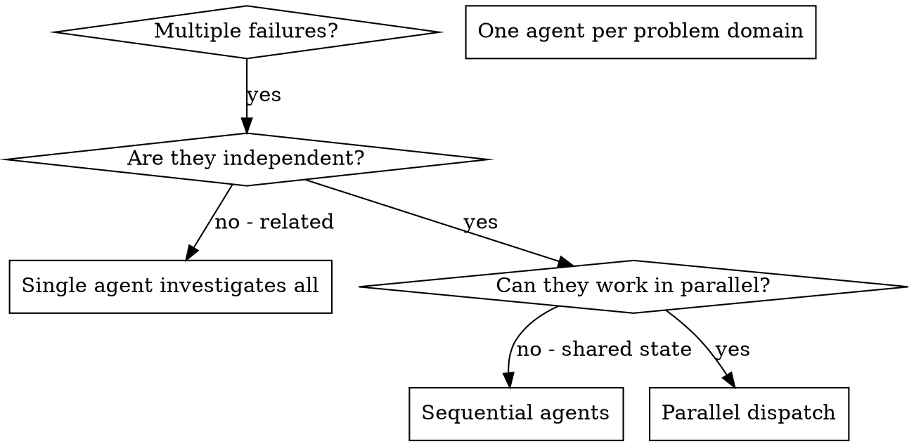

# Dispatching Parallel Agents

## Overview

You delegate tasks to specialized agents with isolated context. By precisely crafting their instructions and context, you ensure they stay focused and succeed at their task. They should never inherit your session's context or history — you construct exactly what they need. This also preserves your own context for coordination work.

When you have multiple unrelated failures (different test files, different subsystems, different bugs), investigating them sequentially wastes time. Each investigation is independent and can happen in parallel.

**Core principle:** Dispatch one agent per independent problem domain. Let them work concurrently.

## When to Use



**Use when:**
- 3+ test files failing with different root causes
- Multiple subsystems broken independently
- Each problem can be understood without context from others
- No shared state between investigations

**Don't use when:**
- Failures are related (fix one might fix others)
- Need to understand full system state
- Agents would interfere with each other

## The Pattern

### 1. Identify Independent Domains

Group failures by what's broken:
- File A tests: Tool approval flow
- File B tests: Batch completion behavior
- File C tests: Abort functionality

Each domain is independent - fixing tool approval doesn't affect abort tests.

### 2. Create Focused Agent Tasks

Each agent gets:
- **Specific scope:** One test file or subsystem
- **Clear goal:** Make these tests pass
- **Constraints:** Don't change other code
- **Expected output:** Summary of what you found and fixed

### 3. Dispatch in Parallel

Use the `task` tool with `subagent_type: "general"` for a
`Subagent (general-purpose):` dispatch. Pass the fully filled prompt
as the task description. Keep dependent steps sequential; issue
multiple `task` calls in one turn for independent work.


For independent work like the three fixes above, issue every dispatch together so they run concurrently:

```text
Subagent (general-purpose): "Fix agent-tool-abort.test.ts failures"
Subagent (general-purpose): "Fix batch-completion-behavior.test.ts failures"
Subagent (general-purpose): "Fix tool-approval-race-conditions.test.ts failures"
# All three run concurrently.
```

Keep dependent steps sequential — one dispatch, then the next.

### 4. Review and Integrate

When agents return:
- Read each summary
- Verify fixes don't conflict
- Run full test suite
- Integrate all changes

## Agent Prompt Structure

Good agent prompts are:
1. **Focused** - One clear problem domain
2. **Self-contained** - All context needed to understand the problem
3. **Specific about output** - What should the agent return?

```markdown
Fix the 3 failing tests in src/agents/agent-tool-abort.test.ts:

1. "should abort tool with partial output capture" - expects 'interrupted at' in message
2. "should handle mixed completed and aborted tools" - fast tool aborted instead of completed
3. "should properly track pendingToolCount" - expects 3 results but gets 0

These are timing/race condition issues. Your task:

1. Read the test file and understand what each test verifies
2. Identify root cause - timing issues or actual bugs?
3. Fix by:
   - Replacing arbitrary timeouts with event-based waiting
   - Fixing bugs in abort implementation if found
   - Adjusting test expectations if testing changed behavior

Do NOT just increase timeouts - find the real issue.

Return: Summary of what you found and what you fixed.
```

## Common Mistakes

**❌ Too broad:** "Fix all the tests" - agent gets lost
**✅ Specific:** "Fix agent-tool-abort.test.ts" - focused scope

**❌ No context:** "Fix the race condition" - agent doesn't know where
**✅ Context:** Paste the error messages and test names

**❌ No constraints:** Agent might refactor everything
**✅ Constraints:** "Do NOT change production code" or "Fix tests only"

**❌ Vague output:** "Fix it" - you don't know what changed
**✅ Specific:** "Return summary of root cause and changes"

## When NOT to Use

**Related failures:** Fixing one might fix others - investigate together first
**Need full context:** Understanding requires seeing entire system
**Exploratory debugging:** You don't know what's broken yet
**Shared state:** Agents would interfere (editing same files, using same resources)

## Real Example from Session

**Scenario:** 6 test failures across 3 files after major refactoring

**Failures:**
- agent-tool-abort.test.ts: 3 failures (timing issues)
- batch-completion-behavior.test.ts: 2 failures (tools not executing)
- tool-approval-race-conditions.test.ts: 1 failure (execution count = 0)

**Decision:** Independent domains - abort logic separate from batch completion separate from race conditions

**Dispatch:**
```
Agent 1 → Fix agent-tool-abort.test.ts
Agent 2 → Fix batch-completion-behavior.test.ts
Agent 3 → Fix tool-approval-race-conditions.test.ts
```

**Results:**
- Agent 1: Replaced timeouts with event-based waiting
- Agent 2: Fixed event structure bug (threadId in wrong place)
- Agent 3: Added wait for async tool execution to complete

**Integration:** All fixes independent, no conflicts, full suite green

## Verification

After agents return:
1. **Review each summary** - Understand what changed
2. **Check for conflicts** - Did agents edit same code?
3. **Run full suite** - Verify all fixes work together
4. **Spot check** - Agents can make systematic errors

## Safe Parallel Implementation: The Worktree Gate

The pattern above is for read-only investigation. Parallel *implementation* — two
or more workers writing code concurrently — was banned outright in the execution
skills for years, on one word: `(conflicts)`. That reason has expired. `git worktree`
gives each worker its own checkout of the repo, so two implementers editing disjoint
files in separate worktrees cannot conflict. This section defines when concurrent
implementers are safe, and how to fall back when they are not.

### Validate the plan before applying the gate

Parallel scheduling is only safe when the plan exposes the data the scheduler
reads. Before grouping any implementation tasks, validate every task. Each task
MUST contain all four of these non-empty fields:

- `Files:` — the exact paths the task may create, modify, or test;
- `Interfaces:` — the container for the dependency declaration;
- `Consumes:` — exact interfaces consumed, or the explicit value `None`; and
- `Produces:` — exact interfaces produced, or the explicit value `None`.

Missing a field is a plan-validation failure, not evidence that tasks are
independent. Stop before dispatch and return the plan for repair. Do not silently
substitute an empty list, infer paths from task prose, or downgrade a malformed
plan to sequential execution: sequential execution prevents write collisions but
cannot repair an underspecified worker brief.

### The gate — four conditions, all required

A wave of tasks may run its implementers concurrently only when ALL FOUR hold:

1. **Files disjoint.** No two tasks in the wave list the same path in their `Files:`
   block (either `Create:` or `Modify:`). A file appearing in two tasks is a merge
   conflict waiting to happen, and the plan is what shows you before you dispatch.
2. **No `Consumes` / `Produces` edge inside the wave.** If Task B's `Consumes:`
   names an interface Task A's `Produces:` supplies, A must land before B; they
   cannot be in the same wave. `write-plan` already requires those blocks
   (`write-plan/SKILL.md`, "Interfaces:") — this is what reads them.
3. **One worktree per worker.** Each concurrent implementer gets its own linked
   worktree, created before dispatch (`use-worktrees` Step 1d). Two workers
   sharing one checkout defeats the isolation and reintroduces the ban's original
   hazard.
4. **Pairwise-unique linked Git directories.** Validate every worker cwd before
   dispatch. In each cwd, resolve both paths with
   `git rev-parse --path-format=absolute --git-dir` and
   `git rev-parse --path-format=absolute --git-common-dir`. The two paths must
   differ (it is a linked worktree), and every worker's resolved `--git-dir` must
   differ from every other worker's. Comparing cwd strings is insufficient:
   symlinks and aliases can name the same checkout.

Fail a disjointness or dependency condition and the wave is serial. If creating
or validating even one worktree fails, do not dispatch a partial parallel wave:
run the entire wave sequentially from the controller's current, validated tree.
Malformed task metadata fails plan validation as described above.

The isolation gate is a git question, not a harness question. Any harness that
shells out to git can make the check deterministically before it dispatches.

### Degradation ladder

State this exact two-rung ladder wherever a skill hands the reader a parallel
implementation instruction:

1. **Worktree-isolated parallel dispatch** — the gate holds and each worker
   has its own linked worktree. Preferred.
2. **Sequential dispatch** — run the wave one task at a time. Correct in every harness,
   merely slower. Always a valid fallback and never a defect.

A missed parallel dispatch produces serial execution, which is correct. A missed
isolation check produces a silent write collision, which is not. That asymmetry
is why there is no unisolated-parallel rung.

### The divergent-tree rule

Concurrent workers read and edit different trees. Their reports refer to files
by path and line, and the same path at the same line number can hold different
content in two worktrees whose branch points differ. On 2026-08-31, three
agents disputed one citation — the same file at the same line — and reached
three answers because the row had landed in a commit one worktree's base
predated.
Nobody ran a bad command. That is the standing failure mode of fan-out
execution, and it is what these rules exist to prevent:

- **Every wave branches from one recorded base SHA.** Record it before dispatch
  and hand it to every worker. A worker branched from an older base is not
  merely behind; it will read and cite different content at the same coordinates.
- **A worker's findings are scoped to the tree it read.** Its report names the
  SHA it read at, and a reviewer comparing two workers' claims compares SHAs
  first.
- **Cross-boundary citations use a test name, symbol, or quoted sentence — never
  a line number.** Line numbers are only valid within one tree at one commit,
  which is precisely what a wave does not have.
- **Read files from the tree they live in.** For anything outside the worker's
  package, read from main (or the recorded base), not from a sibling worker's
  branch, which may have diverged.
