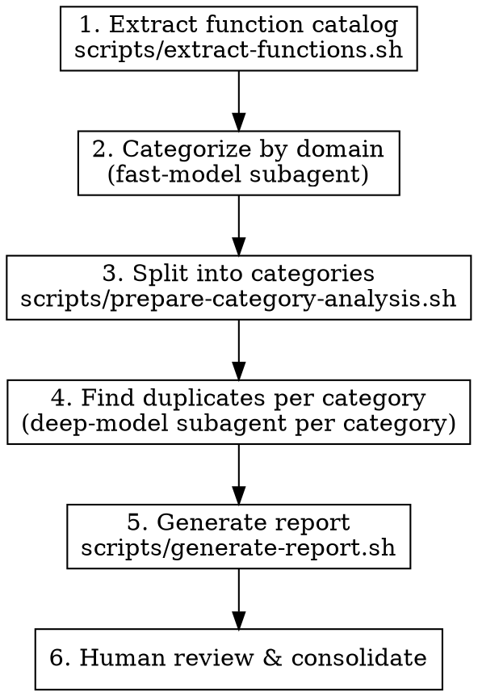

# Finding Duplicate-Intent Functions

## Overview

LLM-generated codebases accumulate semantic duplicates: functions that serve the same purpose but were implemented independently. Classical copy-paste detectors (jscpd) find syntactic duplicates but miss "same intent, different implementation."

This skill uses a two-phase approach: classical extraction followed by LLM-powered intent clustering.

## When to Use

- Codebase has grown organically with multiple contributors (human or LLM)
- You suspect utility functions have been reimplemented multiple times
- Before major refactoring to identify consolidation opportunities
- After jscpd has been run and syntactic duplicates are already handled

## Quick Reference

| Phase | Tool | Model | Output |
|-------|------|-------|--------|
| 1. Extract | `scripts/extract-functions.sh` | - | `catalog.json` |
| 2. Categorize | `scripts/categorize-prompt.md` | the configured fast model | `categorized.json` |
| 3. Split | `scripts/prepare-category-analysis.sh` | - | `categories/*.json` |
| 4. Detect | `scripts/find-duplicates-prompt.md` | the configured deep-reasoning model | `duplicates/*.json` |
| 5. Report | `scripts/generate-report.sh` | - | `report.md` |

## Process

### Phase 1: Extract Function Catalog

Resolve [skills/finding-duplicate-functions/scripts/extract-functions.sh](scripts/extract-functions.sh) relative to this loaded document, then invoke it with arguments `src/ -o catalog.json`.

Options:
- `-o FILE`: Output file (default: stdout)
- `-c N`: Lines of context to capture (default: 15)
- `-t GLOB`: File types (default: `*.ts,*.tsx,*.js,*.jsx`)
- `--include-tests`: Include test files (excluded by default)

Test files (`*.test.*`, `*.spec.*`, `__tests__/**`) are excluded by default since test utilities are less likely to be consolidation candidates.

### Phase 2: Categorize by Domain

Dispatch a **the configured fast model** subagent using [skills/finding-duplicate-functions/scripts/categorize-prompt.md](scripts/categorize-prompt.md), resolved relative to this loaded document.

Insert the contents of `catalog.json` where indicated in the prompt template. Save output as `categorized.json`.

### Phase 3: Split into Categories

Resolve [skills/finding-duplicate-functions/scripts/prepare-category-analysis.sh](scripts/prepare-category-analysis.sh) relative to this loaded document, then invoke it with arguments `categorized.json ./categories`.

Creates one JSON file per category. Only categories with 3+ functions are worth analyzing.

### Phase 4: Find Duplicates (Per Category)

For each category file in `./categories/`, dispatch a **the configured deep-reasoning model** subagent using [skills/finding-duplicate-functions/scripts/find-duplicates-prompt.md](scripts/find-duplicates-prompt.md), resolved relative to this loaded document.

Save each output as `./duplicates/<category-name>.json`.

### Phase 5: Generate Report

Resolve [skills/finding-duplicate-functions/scripts/generate-report.sh](scripts/generate-report.sh) relative to this loaded document, then invoke it with arguments `./duplicates ./duplicates-report.md`.

Produces a prioritized markdown report grouped by confidence level. This is rung 4 (markdown) of the shared native-rendering ladder in [skills/_shared/native-rendering.md](../_shared/native-rendering.md), resolved relative to this loaded document. The file on disk is what Phase 6 review consumes and is the source of truth. If your human partner wants a scannable version alongside it (a sortable table, colour-coded confidence bands), walk the ladder from the top:

Rung 1 is unavailable. Start at rung 2, the brainstorm browser
companion. If the client cannot bind or open the browser companion,
fall directly to rung 4, a markdown file. A task artifact is not a
substitute for a presentation artifact. Announce the rung you took.

The markdown report always ships regardless.

### Phase 6: Human Review

Review the report. For HIGH confidence duplicates:
1. Verify the recommended survivor has tests
2. Update callers to use the survivor
3. Delete the duplicates
4. Run tests

## High-Risk Duplicate Zones

Focus extraction on these areas first - they accumulate duplicates fastest:

| Zone | Common Duplicates |
|------|-------------------|
| `utils/`, `helpers/`, `lib/` | General utilities reimplemented |
| Validation code | Same checks written multiple ways |
| Error formatting | Error-to-string conversions |
| Path manipulation | Joining, resolving, normalizing paths |
| String formatting | Case conversion, truncation, escaping |
| Date formatting | Same formats implemented repeatedly |
| API response shaping | Similar transformations for different endpoints |

## Common Mistakes

**Extracting too much**: Focus on exported functions and public methods. Internal helpers are less likely to be duplicated across files.

**Skipping the categorization step**: Going straight to duplicate detection on the full catalog produces noise. Categories focus the comparison.

**Using the configured fast model for duplicate detection**: the fast role is cost-effective for categorization but misses subtle semantic duplicates. Use the configured deep-reasoning model for the actual duplicate analysis.

**Consolidating without tests**: Before deleting duplicates, ensure the survivor has tests covering all use cases of the deleted functions.
